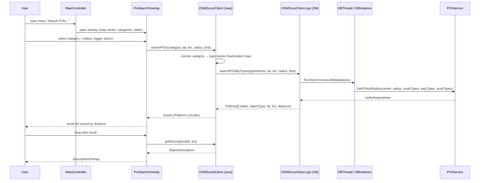

## Context

See proposal.md — Why. JavaScout has location search (`SearchOverlay` + `OSMScoutClient.searchLocations`), a main menu (`javascout-main-menu`), and a long-press details dialog (`MainController.onLongPress` → `getDescription` → `DescriptionOverlay`). The native client (`libosmscout-client-java`) has no POI search method yet. The C++ core provides `osmscout::POIService::GetPOIsInRadius(location, maxDistance, nodeTypes, nodes, wayTypes, ways, areaTypes, areas)`, and `libosmscout-client`'s `POILookupModule::doPOIlookup` already demonstrates the type-name → `TypeConfig::GetTypeInfo` → `TypeInfoSet` → `POIService` pattern. The standard stylesheet (`stylesheets/map.ost`) defines granular types for hotels (`tourism_hotel`, `tourism_motel`, `tourism_hostel`, `tourism_guest_house`) and restaurants (`amenity_restaurant`, `amenity_fast_food`), but only a generic `shop` type for shops — no `shop_supermarket`/`shop_convenience`/`shop_grocery`.

## Goals / Non-Goals

**Goals:**
- Add a POI search entry to the JavaScout main menu opening a dedicated POI search UI.
- Support three hardcoded categories: Hotels, Restaurants, Grocery store.
- Search around the current map center with a stepped radius slider.
- Reuse the existing details dialog (`DescriptionOverlay`) for long-click on results.
- Keep the native JNI method generic (type-name based) so category mapping stays in Java.

**Non-Goals:**
- No user-configurable category→type mapping (hardcoded per request).
- No granular shop types added to `map.ost` (would require database re-import).
- No POI search on the basemap database (same policy as location search).
- No search cancellation UI in this iteration.

## Decisions

### D1: Category→type mapping lives in Java client layer

`OSMScoutClient.searchPOIs(category, lat, lon, radiusMeters, limit)` (Java) resolves the category to a list of OSM type names via a hardcoded map, then calls a generic native method `searchPOIsByTypes(String[] typeNames, lat, lon, radiusMeters, limit)`.

- **Alternative A (mapping in C++ JNI)**: native code switches on category string. Rejected: mapping changes require C++ rebuild; Java-side map is unit-testable without native lib.
- **Alternative B (mapping in JavaScout app)**: app passes type names. Rejected: spec contract is category-based on `OSMScoutClient`; keeping mapping in client-java makes it reusable by other Java clients.

Category mappings (first iteration):
- `hotels` → `tourism_hotel`, `tourism_motel`, `tourism_hostel`, `tourism_guest_house`
- `restaurants` → `amenity_restaurant`, `amenity_fast_food`
- `grocery` → `shop` (generic shop type; see D2)

### D2: Grocery store maps to granular food/beverage shop types

`stylesheets/map.ost` defines granular shop types for the OSM `Key:shop` "Food, beverages" group (supermarket, convenience, grocery, greengrocer, butcher, bakery, deli, cheese, dairy, seafood, frozen_food, health_food, farm, food, confectionery, pastry, chocolate, coffee, tea, spices, alcohol, beverages, wine, ice_cream), each with a `_building` variant following the amenity pattern. "Grocery store" maps to those 24 types instead of the generic `shop` type.

- **Alternative A (generic `shop` type)**: worked with existing databases but returned all shops (clothing, electronics, ...) — rejected after user feedback.
- **Alternative B (name-based filtering on `shop` results)**: unreliable (names vary, many shops unnamed).
- **Cost**: databases must be re-imported with the updated `map.ost` to gain the new types; until then the category returns no results for those types (unknown types are skipped with a warning).

### D3: Radius search via `POIService::GetPOIsInRadius`

The slider defines a radius; the engine searches a circle around the map center.

- **Alternative A (bounding-box via `GetPOIsInArea`)**: square area, simpler to compute from radius, but includes corner regions outside the radius — violates "within the requested radius" semantics.
- **Alternative B (radius)**: matches spec wording; `GetPOIsInRadius` takes `osmscout::Distance` directly.

### D4: New `PoiEntry` result class instead of reusing `LocationEntry`

`LocationEntry` carries location-search fields (region hierarchy, postal area, match quality) that do not apply to POI results. A dedicated `PoiEntry` (label, objectType, lat, lon, distance) keeps the contract clean.

- **Alternative A (reuse `LocationEntry`)**: no new class, but misleading unused fields and no distance field.
- **Alternative B (new `PoiEntry`)**: clean contract, matches spec.

### D5: Dedicated `PoiSearchOverlay` instead of extending `SearchOverlay`

`SearchOverlay` is already a complexity hotspot (cc=22). POI search has different controls (category list, radius slider) and a different result flow.

- **Alternative A (extend `SearchOverlay` with a POI mode)**: fewer new files, but increases coupling and complexity of an already-large class.
- **Alternative B (separate overlay)**: isolated, testable, mirrors existing overlay pattern (`RoutePanel`, `SearchOverlay`).

### D6: Long-click on result reuses existing description machinery

A press-and-hold timer on the result list cell (same 500ms default as map long-press) triggers `OSMScoutClient.getDescription(lat, lon)` and shows the result in the existing `DescriptionOverlay`.

- **Alternative A (context menu)**: discoverable but not requested; adds menu plumbing.
- **Alternative B (double-click)**: not requested; conflicts with single-click navigation.
- **Risk**: press-and-hold on a cell may also fire the click handler on release — the timer must suppress the click when it fires (same pattern as `MapInteractionHandler`).

### D7: Async search via `javafx.concurrent.Task` on daemon thread

Follows the existing `SearchOverlay.performSearch` pattern: `Task` on daemon thread, results marshalled via `Platform.runLater`. Native side reuses the existing breaker infrastructure (`g_searchMutex`/`g_currentBreaker`) so a new search cancels a running one.

- **Alternative A (synchronous on FX thread)**: blocks UI on large radii — rejected.
- **Alternative B (no breaker)**: simpler, but overlapping searches could interleave results — rejected.

## Sequence

## Risks / Trade-offs

- [Grocery category requires re-imported database] → New granular shop types only exist in databases imported with the updated `map.ost`; older databases return no grocery results (types skipped with warning). Re-import to fix.
- [Type names missing in a database's TypeConfig (different stylesheet)] → Unknown names skipped with warning (POILookupModule pattern); empty result, no error.
- [Large radius → slow search] → Async task + breaker; limit caps result count; slider max bounds the radius.
- [Long-press on cell conflicts with click navigation] → Timer suppresses click when long-press fires (D6).
- [Basemap has no POI index] → Basemap databases skipped, same as location search.

## Migration Plan

Additive feature — no data migration. Rollback: remove the menu entry and overlay; native method is additive and unused by other clients.

## Open Questions

- Exact slider step values (e.g. 500m/1km/2km/5km/10km/20km) — cosmetic, decided during implementation.
