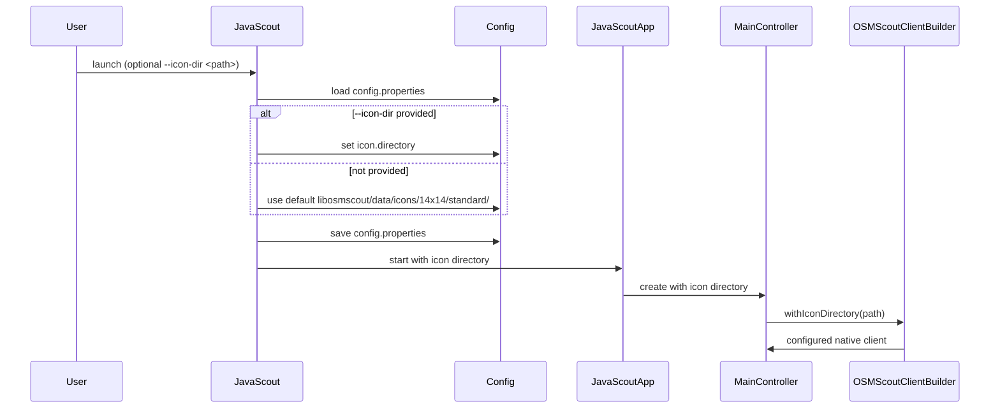

## Context

JavaScout is a Java/JavaFX demonstration application built on the `libosmscout-client-java` JNI bindings. The native `OSMScoutClientBuilder` already supports an icon directory via `withIconDirectory()`, but JavaScout never exposed this setting. The map renderer therefore draws no POI icons, making the map look bare.

Currently the only icon-related code is a hard-coded path inside `MainController`. That path is both wrong for a configurable application and duplicates the source-of-truth that should live in configuration/CLI startup.

This design makes the icon directory a first-class, persisted JavaScout setting.

## Goals / Non-Goals

**Goals:**
- Add a user-configurable icon directory to JavaScout.
- Provide a sensible default that works in a normal libosmscout source checkout: `libosmscout/data/icons/14x14/standard/`.
- Persist the directory in `config.properties` so it survives restarts.
- Remove the hard-coded icon path from `MainController`.
- Pass the configured directory to `OSMScoutClientBuilder.withIconDirectory()` when the native client is constructed.

**Non-Goals:**
- Changing the native C++ icon loading code or the JNI bindings API.
- Adding per-icon theming, remote URLs, or runtime icon reloading.
- Validating icon files inside JavaScout (only directory existence may be checked).

## Flow

## Decisions

**Default directory: `libosmscout/data/icons/14x14/standard/`**
- The Cairo renderer used by the Java/JNI client loads PNG icons only (`MapPainterCairo.cpp` hard-codes `.png`). The `14x14/standard` subdirectory contains the PNG versions of the standard icon set; the SVG directory is not usable by this backend.
- The `javascout.sh` launcher passes an absolute `--icon-dir` pointing at `$PROJECT_DIR/libosmscout/data/icons/14x14/standard`. This makes the default work regardless of the user's working directory.
- A migration is included: if the persisted config contains the old SVG default (`libosmscout/data/icons/svg/standard`), `Config.getIconDirectory()` returns the PNG default instead.

**Expose the setting as a `--icon-dir` command-line option**
- This makes it scriptable and discoverable without editing property files.
- Alternative: Java system property or environment variable. Rejected: explicit CLI flag is easier to document and matches the existing JavaScout argument style.

**Persist the value via the existing `Config` abstraction**
- Reuses `config.properties` and keeps load/save logic in one place.
- New key: `icon.directory`.

**Pass icon directory via system property in addition to static field**
- JavaFX `Application.launch()` can create the application instance in a context where static fields set before launch are not reliably visible. `JavaScout.main()` therefore sets `javascout.iconDirectory` as a system property; `JavaScoutApp.start()` reads the property and falls back to the static field only for tests.
- Alternative: pass via JavaFX application parameters. Rejected: the existing code filters launcher-only flags out of the args passed to JavaFX; keeping `--icon-dir` filtered avoids exposing it to JavaFX internals.

**Launcher must use a rebuilt native library**
- `javascout.sh` searches several build directories for `libosmscout-client-java/src` and uses the first match. If the first match is an older build, the C++ fix is not loaded. A diagnostic echo was added so the chosen native library path is visible.
- For this fix to take effect, the matching build directory must be rebuilt after the C++ change.

**Icon directory must reach the Cairo renderer**
- `OSMScoutClientBuilder.withIconDirectory()` stores the directory in `DBThread`, but the Java JNI render path creates a fresh `osmscout::MapParameter` and never calls `SetIconPaths()`. The directory therefore never reached `MapPainterCairo.cpp`, causing `ERROR while loading image` even when configured.
- Added `DBThread::GetIconDirectory()` and set `MapParameter::SetIconPaths({iconDir})` inside `OSMScoutClient.cpp` before `DrawMap()`.
- This is a native-side fix in `libosmscout-client-java`; the Java layers were already passing the value correctly.

**Pass the directory with trailing path separator**
- `MapPainterCairo.cpp` builds icon filenames by concatenating `path + iconName + ".png"` without inserting a separator. The configured directory must end with `/` (or `\\` on Windows) for lookups to resolve correctly.
- `MainController` normalises the directory before calling `withIconDirectory()`, appending `/` if missing.

**CLI override also updates the saved config**
- If the user passes `--icon-dir`, the new value becomes the persisted default for future runs.
- Trade-off: a CLI flag normally implies a one-time override. Persisting is simpler for a desktop demo with no separate "settings" dialog; if a transient override is needed later, the design can be extended.

**Empty directory handling**
- If the configured directory is empty, JavaScout will not call `withIconDirectory()`, preserving the current no-icon behavior and avoiding an invalid JNI call.

## Risks / Trade-offs

- **Relative default path depends on the working directory.** If JavaScout is launched from another directory, icons will not be found.  
  → Mitigation: `javascout.sh` now passes an absolute `--icon-dir` based on its own project detection.
- **Stale native library may hide the fix.** `javascout.sh` picks the first build directory it finds; if that library predates the C++ change, icons still fail.  
  → Mitigation: script now logs the chosen native library path; rebuild that directory after C++ changes.
- **Persisted invalid path may break icons on next launch.** A user could save a path that does not exist.  
  → Mitigation: log a warning when the directory is missing; the native renderer will gracefully skip icons.
- **Single global icon directory.** Styles other than the standard stylesheet may need different icons.  
  → Mitigation: out of scope for this change; future work can add per-style directory support.

## Migration Plan

No migration required. Existing `config.properties` files will not contain an `icon.directory` key, so JavaScout will fall back to the new default on first launch and persist it.

## Open Questions

1. Should JavaScout validate that the icon directory exists before passing it to the native builder, or only warn?  
   *Proposed:* warn only, to keep behavior resilient.
2. Should the `--icon-dir` flag be transient (not saved) and only `config.properties`/future UI edits persist?  
   *Proposed:* save CLI overrides for now.
