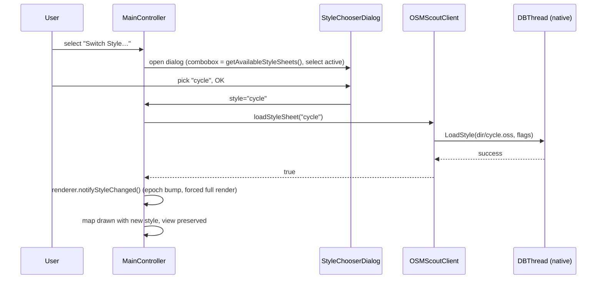

# Style Switcher — Design

## Context

Motivation in proposal.md (Why). Requirements in `specs/javascout-style-switcher/spec.md` and `specs/client-java-style-switching/spec.md`.

Current state:

- JavaScout is a JavaFX app. It builds `OSMScoutClient` via `OSMScoutClientBuilder` with a stylesheet directory (default `"stylesheets"`, resolved in `MainController.initClientAndRenderer`) and renders through `MapRenderer` (Cairo backend, ARGB array per frame). Redraws are app-driven: `renderer.requestRender(...)` / `requestRenderPreserveRoute(...)`.
- libosmscout-client (C++) already supports runtime stylesheet switching:
  - `DBThread::LoadStyle(filename, flags)` / `ReloadStyle()` reload `StyleConfig` on every `DBInstance` (incl. basemap), under the DB thread's write lock; `LoadStyleInternal` updates `stylesheetFilename` and emits `stylesheetFilenameChanged`.
  - `Settings` persists `OSMScoutLib/Rendering/StylesheetDirectory` (default `"stylesheets"`) and `StylesheetFile` (default `"standard.oss"`); flags are stored per stylesheet file under `StylesheetFlags/<file>/`.
  - `DBThread::SetStyleFlag` exists and reloads the current style with a flag.
- libosmscout-client-java exposes only `setStyleSheetFlag(String, boolean)` via JNI (`OSMScoutClient.cpp`); no enumeration, no full style switch.
- JavaScout main menu is a `ContextMenu` built in `MainController.createMainMenuButton()` with items Favorites, Import GPX Track…, Search POIs…, Simulate GPS Fix…, Download Maps….

## Goals / Non-Goals

**Goals:**
- Minimal JNI surface: enumeration stays in Java; native side only adds directory/active-style getters and one switch call.
- Reuse existing C++ switching machinery (LoadStyle + Settings persistence) — no new render pipeline work.
- One code path for style switching in client-java usable by any Java app, JavaScout UI on top.

**Non-Goals:**
- No changes to libosmscout core or libosmscout-map rendering pipeline.
- No new stylesheet format, no flag-editing UI, no thumbnail previews of styles.
- No live-reload on file change (that is `ReloadStyle`, out of scope).

## Decisions

### D1: Switch API lives on OSMScoutClient (client-java), UI in JavaScout

New API on `OSMScoutClient`:
- `String getStyleSheetDirectory()` — JNI, reads `Settings::GetStyleSheetDirectory()` (single source of truth; C++ default `"stylesheets"` applies when unset).
- `List<String> getAvailableStyleSheets()` — Java, scans directory for top-level `*.oss`, name = filename without `.oss`, sorted alphabetically; non-`.oss` ignored.
- `String getActiveStyleSheet()` — JNI, reads `Settings::GetStyleSheetFile()`.
- `boolean loadStyleSheet(String name)` — JNI: resolve `dir + "/" + name + ".oss"`, `Settings::SetStyleSheetFile(file)`, `DBThread::LoadStyle(absolute, currentFlags)`, returns success.

JavaScout: new menu item in `createMainMenuButton()`, dialog with `ComboBox<String>`, on confirm calls `loadStyleSheet`, on success `renderer.requestRenderPreserveRoute(...)`.

Rationale: switching logic lives in client/client-java (user requirement); enumeration in Java avoids JNI `String[]` marshalling for a trivial directory scan; C++ Settings stays the source of truth for directory/file defaults so behavior matches OSMScout2.

Alternatives considered:
- Full enumeration in C++ returning `String[]` — rejected: extra JNI marshalling, no behavioral gain; directory scan is I/O, not core logic.
- Enumeration in JavaScout app itself — rejected: duplicates directory-default logic in the app and puts "logic" outside the client library as the user asked against.

### D2: Switching updates Settings and uses persisted flags

`loadStyleSheet` calls `SetStyleSheetFile` (persists choice, emits `styleSheetFileChanged`) then `DB::LoadStyle(absoluteFile, stylesheetFlags)` so currently enabled flags (daylight, etc.) apply to the new style (spec: "Style flags survive a switch").

Rationale: mirrors `SetStyleFlag` flow; persistence means the chosen style survives restart (DBThread init reads Settings).

Alternatives considered:
- Transient switch (LoadStyle only, no Settings write) — simpler, but choice lost on restart and `ReloadStyle`/flag toggles would silently revert to the old persisted file. Rejected.
- Dedicated flags reset on switch — rejected: spec requires flags to survive.

### D3: Synchronous bool return; app triggers redraw

`loadStyleSheet` returns `true`/`false` synchronously (the JNI side submits to the DB thread and blocks via `StdFuture().get()` until the load completes; style loading itself runs on the DB thread, as all DB work does). JavaScout redraws only on `true`; on `false` it shows an error and keeps the current render (spec: unloadable stylesheet keeps previous style).

The redraw uses `MapRenderer.notifyStyleChanged()` rather than a plain re-request: it bumps the renderer epoch (invalidating the epoch-keyed `TileCache` and the front buffer) and forces a full render, skipping the sub-region blit path. A plain `requestRenderPreserveRoute` with unchanged coordinates would be served from the cached front buffer painted with the previous style and never show the switch.

Rationale: matches existing JNI pattern (fire-and-forget `CancelableFuture` in C++, no callback plumbing); render loop is already app-driven, so the app is naturally "notified" by the return value and redraws.

Alternatives:
- Native push signal on `stylesheetFilenameChanged` via callback into Java — heavier JNI, needed only if JavaScout needed redraw without calling it. Rejected for now; noted as future extension.

### D4: Error surfacing

C++ already collects `StyleError`s on `LoadStyleInternal` and emits `styleErrorsChanged`. JavaScout path: `loadStyleSheet` returns false when the load fails; JavaScout shows an error message. Detailed per-rule error listing is not surfaced (matches current `setStyleFlag` behavior).

Alternative: expose `List<StyleError>` over JNI — rejected for scope; failures are rare (valid files in stylesheets dir) and spec requires only "failure reported to the user".

### Sequence (menu → switch → redraw)

## Risks / Trade-offs

- **[Race] Immediate redraw may render before style load completes** → style load runs on the DB thread under the write latch; render requests are serialized behind it, so the next drawn frame uses the new `StyleConfig`. Acceptable eventual consistency; no action beyond D3.
- **[Invalid/partial stylesheets] Some top-level `.oss` files are partial (boundaries, coastlines, motorways, public-transport, basemap-render)** → per spec contract, all top-level `*.oss` files are candidates. Selecting such a file may yield a sparse map; mitigated by "unloadable stylesheet keeps previous style" and error reporting. Documented behavior, not a bug.
- **[Persistence surprise] Style choice persists across restarts** → intentional (D2), matches OSM2. JavaScout launch always applies Settings file; users returning to app keep last style.
- **[Race on flags]** `setStyleFlag` and `loadStyleSheet` both reload under write lock → serialized, no corruption.

## Migration Plan

- Client-java: additive API; existing callers unaffected. Both build systems (CMake + Meson) register no new files — the change is within existing `OSMScoutClient.cpp`/`.java`.
- JavaScout: additive menu item and dialog; no config schema change.
- Rollback: revert menu wiring; library API additive and unused elsewhere.

## Open Questions

None.
