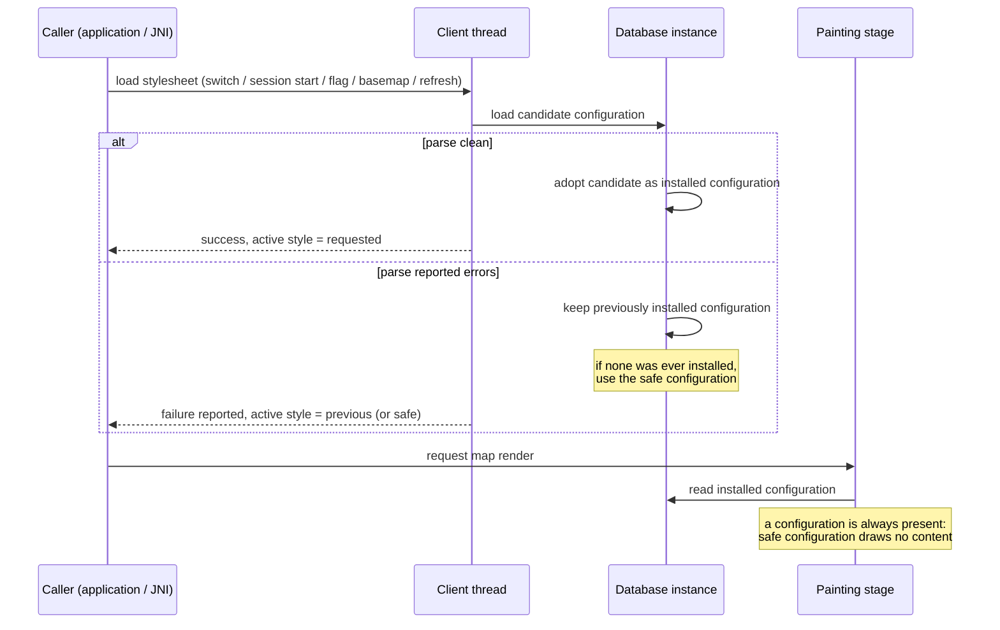

# Design

See `proposal.md` — Why for the crash that motivates this change. This document covers where the
invariant is enforced, what "safe configuration" means for a database, and how the outcome reaches the
caller. Spec: `specs/client-java-style-switching/spec.md`.

## Context

Read while preparing this design (`libosmscout-client/`, `libosmscout-client-java/`):

| Fact | Where |
|---|---|
| A stylesheet that fails to parse is not installed: the candidate configuration is discarded and the database is left with no configuration | `DBInstance::LoadStyle` (`libosmscout-client/src/osmscoutclient/DBInstance.cpp:28-73`) |
| The caller ignores that per-database result and only logs a warning | `DBThread::LoadStyleInternal` (`libosmscout-client/src/osmscoutclient/DBThread.cpp:440-473`) |
| A safe, empty configuration is constructed for exactly this purpose and never installed | `DBThread.cpp:61`, `DBThread.cpp:447` |
| `StyleConfig::Load` reports parser errors and fails when any occurred; the errors are readable afterwards | `libosmscout-map/src/osmscoutmap/StyleConfig.cpp:1830` |
| The render batch skips a database without a configuration, but the painting stage still runs for the batch | `libosmscout-client-java/src/OSMScoutClient.cpp:1273-1371` |
| Only the explicit runtime switch compares the error state before/after and restores the previous stylesheet file | `OSMScoutClient.cpp:796-851` |
| The basemap database has its own type configuration and its own stylesheet file, loaded through the same path | `DBThread.cpp:567-596` |

Constraint: the client library stays platform-independent and backend-independent; the change is
therefore in shared client code, not in a backend, and must not add work to a render call.

## Goals / Non-Goals

**Goals:**

- No stylesheet defect can reach the painting stage as an absent or rejected configuration, on any
  load path.
- A database has a usable configuration at all times, with a defined degraded behaviour instead of a
  fault.
- The outcome of a load (success or failure, and which style is active afterwards) is available to the
  caller on every path.

**Non-Goals:**

- Pre-validating stylesheets in the caller (a second parser would have to mirror the style template
  semantics, including includes and flags).
- Changing what a valid stylesheet renders, or the style template language, or the enumeration/switching
  API shape.
- Making a partially parsed stylesheet usable: a configuration from a parse that reported errors is
  never adopted.
- Changing backend-specific painters or adding a placeholder rendering path.

## Decisions

### D1 — Decide at installation time: adopt a candidate configuration only after a clean parse

**Chosen:** each database loads a stylesheet into a candidate configuration and adopts it only when the
load reported no errors; otherwise the configuration installed before the attempt stays installed.

- Alternative A — install first, then compare the error state and re-parse the previous stylesheet to
  recover (today's explicit-switch behaviour): it re-reads and re-parses a file that may meanwhile be
  gone, and it leaves a window in which the rejected configuration is installed and a render can use it.
- Alternative B — install unconditionally and guard at painting time: the guard would have to be
  repeated on every painting path and for every backend, and the "previous style stays active"
  requirement would be violated while the bad configuration is live.
- Risk of the chosen approach: it changes the assignment of the installed configuration reference, a
  path every style load goes through → mitigated by the existing tests of style switching plus the new
  failure tests, and by keeping the change to the assignment (no parser changes).

### D2 — A database always has a configuration: the existing safe configuration becomes the first-load fallback

**Chosen:** the safe configuration that the client already constructs is installed for a database that
has never loaded a stylesheet successfully in this session. It is a valid configuration with an empty
type configuration, so it draws nothing and cannot fault.

- Alternative A — leave the database without a configuration and refuse the render: several databases
  can be rendered in one batch, so one broken stylesheet would blank the whole map, and the "no
  configuration" state is exactly what reaches the painting stage today.
- Alternative B — a visible placeholder for the affected area: a new rendering path with a UI decision
  the library does not own; the application is responsible for telling the user.
- Risk: the safe configuration's behaviour on a real map surface (empty area versus a filled
  background) has never been exercised → verify explicitly in a test and in a consuming application
  before release.

### D3 — Keep the previously installed configuration for the session, not just for one frame

**Chosen:** a successfully loaded configuration stays installed until a later load succeeds; the safe
configuration is only used when nothing has ever loaded successfully.

- Alternative — reset to the safe configuration after any failed load: a working map would disappear
  because of an unrelated failed load, contradicting the requirement that the previously active style
  remains in effect.
- Risk: a long-lived process keeps a configuration whose stylesheet file has been replaced on disk →
  acceptable: the same is true today, and a stylesheet refresh is an explicit load which either
  succeeds (new configuration) or is refused (old one remains).

### D4 — Report the per-database outcome and the active style; keep the existing error channel

**Chosen:** the load path keeps its existing error list as the diagnostic channel and additionally
reports the per-database outcome and which stylesheet is active after the attempt. The explicit
switch's existing boolean result keeps its meaning and gains the same information.

- Alternative A — exceptions across the client boundary: the client's error style is results plus error
  lists; exceptions would have to cross the JNI boundary and would change every caller.
- Alternative B — a listener/callback interface: more API surface for one event, while the callers
  already have to handle the load result to know whether to redraw.
- Risk: adding a field to the outcome could be confused with the style-file setting (which is stored
  before a load succeeds today) → mitigate by reporting the active style explicitly rather than
  inferring it from the settings.

### D5 — The invariant is owned by the client, so the basemap follows the same rule

**Chosen:** the same rule applies to the basemap database, whose dedicated stylesheet is loaded through
the same path; a basemap stylesheet failure leaves the map rendering and reports the failure.

- Alternative — treat the basemap as special and keep its previous behaviour: the basemap is a database
  like the others in the render batch, so an unguarded failure there is the same fault.

## Flow

Stylesheet load and the failure decision:

## Risks / Trade-offs

- **Every style load goes through the changed assignment** → keep the patch to the install decision and
  the fallback; run the existing client test suites unchanged plus the new failure tests.
- **A silent degradation could hide a real stylesheet defect** → the failure must be reported to the
  caller on every path (spec), and the application that consumes the client surfaces it to the user.
- **The safe configuration's visual behaviour is unproven** → verify with a test and in a consuming
  application that it draws nothing and does not fault, and that a later successful load recovers.
- **Upstream acceptance**: the patch must stay independently mergeable (install-on-clean-parse plus the
  already existing safe configuration); no new configuration knobs, no API removals.
- **Parallel work in the same checkout**: the client sources are edited by other changes in flight →
  one writer at a time, and the change must verify the full client test target before it is committed.
- **Two build systems** (CMake, Meson): the change is source-only, but the test target must build and
  run in the configuration used for verification, and the other configuration must not be broken by it.

## Migration Plan

No API removal, no data migration, no configuration change: a successful load behaves exactly as
before. Deployment: the change lands in the client library; consuming applications pick it up with
their next build after the client revision they use is updated. Rollback: revert the change — the
failure path returns to leaving the database without a configuration (the consuming application then
faults again, which is the state this change exists to remove).

## Open Questions

None that affect the specs, the approach or the tasks: the only outward-facing choices (reporting the
active style, and the safe configuration as the first-load fallback) are decided in D2 and D4.
