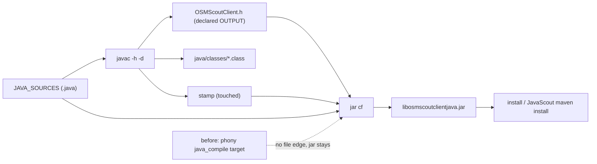

# Design

## Context

See `proposal.md` — Why. The two artifacts of `libosmscout-client-java` are defined twice and the jar is wrong once per build system.

CMake (`libosmscout-client-java/CMakeLists.txt`):

- `JAVA_SOURCES` names 29 `.java` files (including `CurrentRoadInfo.java`, `:16`) and `javac -h` runs from a custom command whose only declared `OUTPUT` is `${JNI_HEADERS_DIR}/com_framstag_libosmscout_client_OSMScoutClient.h` and whose `DEPENDS` is `${JAVA_SOURCES}` (`:44-52`).
- `add_custom_target(java_compile)` is a phony target over that header (`:58-60`).
- The jar command declares `OUTPUT ${JAR_FILE}` but its only `DEPENDS` is the phony target `java_compile` (`:64-70`); `add_custom_target(java_jar ALL DEPENDS ${JAR_FILE})` (`:72-74`) drives it. A phony dependency carries no file timestamp, so once the jar exists the graph has nothing that says the classes changed — `ninja java_jar` reports "no work to do" after a Java source edit while the generated header was rewritten.
- `install(FILES ${JAR_FILE} ...)` (`:136`) installs whatever jar the build tree holds, and `JavaScout/build.sh` installs that jar into the local Maven repository, so a stale jar reaches a consumer as a compile failure, not as a build error.

Meson (`libosmscout-client-java/java/meson.build`): the Java sources are listed twice — once for `native_headers()` and once for `jar()` — and neither list names `com/framstag/libosmscout/client/CurrentRoadInfo.java`, while CMake compiles it. The two build systems therefore produce different jars for the same tree. The class is a standalone result type of the client package; it is referenced by neither the JNI bridge (`libosmscout-client-java/src/OSMScoutClient.cpp`) nor another client Java source, and `JavaScout` carries its own copy in the application package.

## Goals / Non-Goals

**Goals:**

- The jar of either build system corresponds to the Java sources present at build time, without a manual step.
- The two build systems package the same Java source set, verified by comparing the jar entries.
- No Java API change, no JNI change, no install-location change, no database or file-format involvement.

**Non-Goals:**

- A single shared source manifest that both build systems read, and a check that the two rosters agree (a permanent cure for the class of divergence). It touches how both build systems declare the Java sources and belongs in its own change; recorded as a candidate, not done here.
- Making the jar reproducible (fixed entry order/timestamps), pinning a `javac`/`jar` version, or changing the Java language level.
- Fixing the Meson/CMake test-roster divergence (the analogous problem on the test side), which is a separate TODO entry.

## Decisions

**D1 — Give the CMake jar rule file-level inputs instead of a phony target.**

Chosen: after `javac`, touch a stamp file, and let the jar command depend on that stamp, the generated header and `JAVA_SOURCES`:

```
javac -h <headers> -d <classes> ${JAVA_SOURCES}
  -> OUTPUT header + stamp        (stamp touched unconditionally after javac)
jar ... -C <classes>
  -> OUTPUT jar, DEPENDS stamp, header, ${JAVA_SOURCES}
```



The stamp exists because the class files are rewritten by the same command that declares only the header as its output: a stamp that every `javac` run refreshes carries the "the classes changed" event into the jar edge regardless of whether the header text (and therefore its timestamp) changed.

Alternatives considered:

- *Depend on the header alone*: the header is rewritten by every `javac` run, so this usually works, but it relies on the header being touched when only a non-native class changed — a `javac` that decides not to rewrite an unchanged header would leave the jar stale again. The stamp removes the assumption.
- *Make the jar a `POST_BUILD`/`COMMAND` of the `java_compile` target*: always repackages, so it is always correct, but it rewrites the jar on every build, invalidates the `ALL` target's incrementality and makes every build install a jar whose mtime changed for no reason.
- *Declare the individual `.class` files as outputs of the javac command*: explicit and idiomatic, but requires enumerating the classes of 29 sources (or a glob) in the build file, i.e. a third list that can drift — the very failure mode this change closes.

**D2 — Close the Meson gap by adding the missing source, not by removing it from CMake.**

Chosen: add `com/framstag/libosmscout/client/CurrentRoadInfo.java` to both lists in `libosmscout-client-java/java/meson.build` (the `native_headers()` inputs and the `jar()` inputs), matching how the other 29 files are listed.

Alternatives considered:

- *Remove the source from `JAVA_SOURCES` in CMake*: makes the lists equal with a one-line deletion, but removes a public class from the client jar — a Java API removal for any consumer of the client package, in a change that must not change the API.
- *Add a glob (`java/**/*.java`) to one build system*: removes the list, but the two systems would still not agree on what the set is, and configure-time globbing makes a newly added source invisible until reconfiguration.

**D3 — Verify parity by jar contents, not by comparing the source lists.**

Chosen: the verification step lists the entries of both jars and compares them with the `.java` files under `java/`; the check is part of this change's verification, not a new CI gate.

Alternatives considered:

- *Compare the two source lists textually*: needs the lists parsed out of two build files, breaks when the formatting changes, and cannot see a class that is compiled but not packaged.
- *Add a CI gate that builds both systems and compares jars*: the durable fix, but it adds a job and a second full Java build to CI for a defect that a verification recipe already catches; the CI-gate question is listed as a follow-up candidate in `TODO.md`, not in scope here.

**D4 — Make the bridge take the magnification the way the API intends it: a scale factor, validated, matching the Java declarations.**

Chosen: `render`, `renderWithRouteAndPois` and `projectToPixel` take the magnification as a `double` scale factor (2^zoom level), the Java declarations, the Java convenience overload and their documentation say so, `JavaScout` and the client tests pass `Math.pow(2, level)` from their integer zoom, and the entry points refuse a scale that is not finite, is below 1, or whose level exceeds `CELL_DIMENSION_MAX` — with a warning and no result instead of letting the value reach a projection.

Context: commit `182ad5bed` ("JNI bridge - fractional zoom …") changed the C++ side to `jdouble` and `SetMagnification(std::max(1.0, mag))` **without** touching the Java declarations, which still said `int magnification` and were documented as a level; every caller passed a level, so the bridge read the bits of an unrelated register (~1e288, level 957) — this is the abort that was being verified. NaviVeylin's own binding (`Android/OsmScoutLib`, `osm.scout.Database`/`Projection`/`MercatorProjection`) uses `double magnification` throughout, i.e. a scale factor is the project's convention, and fractional zoom is a deliberate feature of that work.

Alternatives considered:

- *Align the C++ to the Java level (what the first attempt did)*: removes the abort, but drops the fractional-zoom feature the bridge was changed for, and leaves the C++ and Java conventions pointing opposite ways (NaviVeylin's double scale vs a level here). Rejected after the intent was clarified.
- *Keep `int` in the Java API and add a separate fractional method*: backward compatible without touching the callers, but keeps two contracts for one value and leaves the existing method's documentation ("level") wrong for the C++ that read it as a scale.
- *Accept both a level and a scale in the same parameter (heuristic)*: the value ranges overlap (`15` vs `2^15`), so the interpretation would be a guess — exactly the class of defect being fixed.

**D5 — Validate the scale at the boundary and make the lookup itself bounds-safe.**

Chosen: the JNI entry points check finiteness, `>= 1` and `floor(log2(scale)) <= CELL_DIMENSION_MAX` before constructing a `Magnification` (whose own assert would otherwise fire first), and `TileId`'s cell-size lookups go through one helper that reports an out-of-range level and uses the finest cell size instead of indexing past the table.

Alternatives considered:

- *Keep the `std::array::operator[]` assert as the only guard*: it aborts in a debug build (through JNI that is the whole process — the failure observed here) and reads out of bounds in a release build, i.e. the behaviour depends on the build type.
- *Validate only in the JNI layer*: protects the Java path but leaves any other library user that sets an out-of-range level with the same undefined read.
- *Throw*: a library that must not abort a host process should not introduce exceptions across the JNI boundary either; the entry points return a null result per their documented contract instead ("or null if not initialised or invalid params").

## Risks / Trade-offs

- [The stamp makes the jar edge always-fire after a `javac` run] → only when `javac` itself ran, i.e. when a source or the toolchain changed; one extra `jar` invocation per Java edit is negligible and cheaper than a stale artifact.
- [`javac -h` writes headers into the source-tree-adjacent build dir and a removed Java class leaves a stale `.class`/header behind] → pre-existing behaviour; the jar is repackaged from the classes directory, and stale classes in the build tree are a clean-build concern, unchanged here.
- [Adding `CurrentRoadInfo.java` to the Meson jar changes that jar's content] → intended: that is the parity fix; no consumer can regress from gaining a class.
- [The two Java lists in `java/meson.build` can drift again with the next Java source] → acknowledged; the shared-manifest and roster-check ideas are noted as Non-Goals and remain a TODO candidate. The immediate divergence is closed and the verification recipe makes the next one visible.
- [CMake and Meson differ in where the jar lands] (`libosmscout-client-java/libosmscoutclientjava.jar` vs `libosmscout-client-java/java/libosmscoutclientjava.jar`) → `JavaScout/build.sh` already probes both paths; unchanged by this change.
- [The fractional zoom the C++ side claimed is gone] → resolved the other way: the bridge keeps a fractional scale (the NaviVeylin convention), the Java declarations document it, and the callers pass `2^level`; the `TODO.md` entry about it is closed.
- [Changing the Java parameter type can silently change what an external caller means] → the parameter was previously documented as a level while the C++ read it as a scale, so no caller had working semantics; the documentation now states the scale factor and the range, and an out-of-range value is refused with a warning rather than misread.
- [Nothing prevents the next parameter-type mismatch] → `scripts/check-jni-signatures.sh` compares the Java declarations with the JNI functions on the host and is registered as a test in both build systems (137/137 in each); it found the three mismatches this change fixes and named six JNI functions with no Java declaration.
- [The cell-size clamp hides a wrong level from the render path] → the level is validated where it enters (the Java boundary) and an out-of-range level is reported by both the entry point and the lookup, so a wrong level is visible in the log rather than silently rendering at the wrong scale.
- [The pre-existing `std::bad_alloc` abort of `SearchReproTest`] → reproduced with the pre-change library as well, so not this change's defect; recorded in `TODO.md` with the reproduction (it aborts while the client is built with `withMapLookupDirectories(".")`, after the map-directory scan).

## Migration Plan

No deployment or data migration: build-definition only. Rollback is reverting the two build files; a build tree that had the stale jar needs no cleanup beyond the rebuild that the change makes happen. The formatting/static-analysis signal that was considered for this change was dropped: it stays a deferred `TODO.md` item, and nothing here depends on it.
